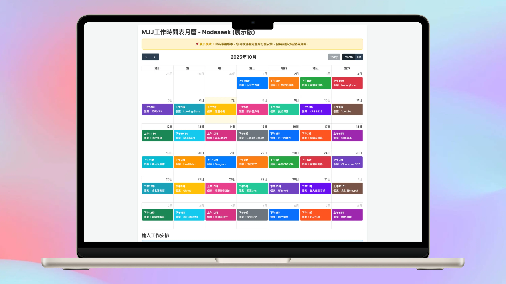
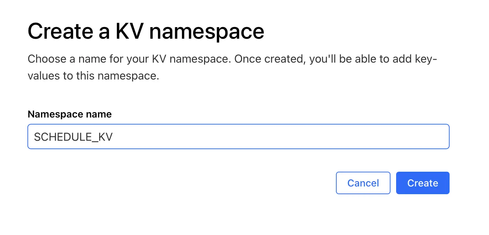
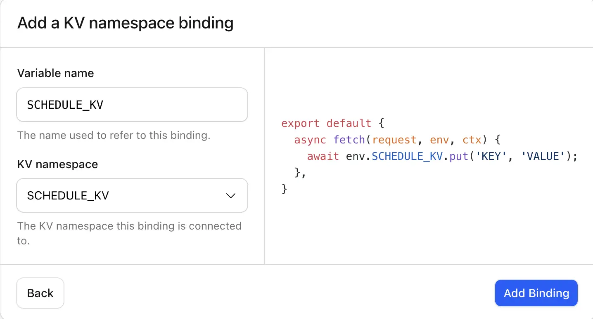

# ✨ CF-Worker 項目：MJJ 專屬買VPS日歷：怕忘續費？怕錯過神車？這個行程表幫你全記下！✨



兄弟們，靈魂拷問來了：

*   你腦子的內存是不是比你小雞的還小？還在用腦袋硬記幾十台小雞的到期日？
*   黑五的神車呼嘯而過，你卻只能看著別人的評測流口水？
*   那台傳家寶，是不是又差點忘了續費，驚出一身冷汗？

## 展示
* **網站：** https://mjj.kkkkkcat.com/mjj
* **密碼：** mjj

---

**別慌！MJJ 終極解決方案來了！**

這是一個 **專為 MJJ 打造的私人行程面板**，部署在 Cloudflare 上，用免費的 KV 當數據庫。**核心就一個字：白嫖！** 幫你記錄所有 VPS 的購買、續費、搶購計劃，讓你在買雞的道路上，永遠走在時間的前面！

## 🚀 這玩意兒到底有多騷？

*   **😎 私人地盤，金屋藏“機”**：設個專屬密碼，你的“後宮佳麗”只有你能看，安全感爆棚！
*   **📅 可視化日歷，一目了然**：自動生成花花綠綠的月歷，哪天該給哪台“雞仔”續命，比看天氣預報還準！
*   **✍️ 懶人格式，隨手就記**：`日期 | 時間 | 什麽機 | 幹什麽`，打字就行，小學生都會用！
*   **⏪ 手賤黨救星，時光倒流**：手滑刪錯了？別怕！自動保存 100 次歷史記錄，一鍵回到“事故”前，堪稱賽博後悔藥！
*   **🌍 全球部署，秒開秒用**：代碼跑在 CF 的全球節點上，打開速度快得像你下單時的手速！

## 部署？告別代碼！三步點完收工！（真·無腦操作版）

忘掉那些黑乎乎的命令行吧！咱們 MJJ 玩兒的就是一個優雅，全程只需點點鼠標！

---

### ➡️ 步驟一：創建 Worker，粘貼代碼就完事！

1.  登錄 Cloudflare 官網，在左邊菜單找到 **Workers & Pages**。
2.  點擊 **Create Application** -> **Create Worker**。
3.  給你的 Worker 取個響亮的名號（比如 `my-vps-empire`），然後點 **Deploy**。
4.  部署好之後，點 **Edit code**。
5.  **劃重點：把右邊默認的代碼全部刪幹凈**，然後把文章最下面的那一~~~大長串代碼 **原封不動地覆制粘貼** 進去。
6.  點擊右上角的 **Save and deploy**。

**恭喜！第一步已經搞定！**

---

### ➡️ 步驟二：創建 KV，給你的“雞”們建個窩！

1.  還是在左邊菜單，點 **Workers & Pages**，然後找到 **KV** 標簽頁。
2.  點擊 **Create a namespace**。
3.  在 **Namespace name** (命名空間名稱) 里輸入 `SCHEDULE_KV`，然後點 **Add**。



**牛逼！第二步也搞定了！**

---

### ➡️ 步驟三：綁定！讓 Worker 和倉庫“手牽手”！（成敗在此一舉！）

這是最最最關鍵的一步，直接決定你的“養雞場”能不能開張！

1.  回到你**步驟一**創建的那個 Worker。
2.  點擊 **Settings** -> **Variables**。
3.  往下拖，找到 **KV Namespace Bindings**，點擊 **Add binding**。
4.  這里有兩個空要填，一個字都不能錯：
    *   **變量名稱 (Variable name)**: **必須！一定！百分之百！** 要填寫 `SCHEDULE_KV`！
    *   **KV 命名空間 (KV namespace)**: 點一下，選擇你**步驟二**創建的那個 `SCHEDULE_KV`。
5.  最後，猛擊 **Save and deploy**。



> ⚠️ **宇宙級重要提醒！** ⚠️
>
> **`變量名稱 (Variable name)`** 必須和代碼里的 `const KV_NAMESPACE = "SCHEDULE_KV";` **完全一致，一個字母一個下劃線都不能差！**
>
> 如果這里填錯，你的 Worker 就像斷了網，找不到數據倉庫，進去就是個寂寞！

**搞定！現在，打開 `https://你的Worker名.你的域名.workers.dev/mjj` 就可以開始管理你的買雞大業了！**

## ⚙️ 個性化調教

部署完，建議花 10 秒鐘改下代碼開頭的幾個地方，讓它更像你自己的東西：

```javascript
// --- 後端設定 ---
const PASSWORD = "mjj";                  // 登錄密碼，快改成你自己的！別裸奔！
const APP_PATH = "/mjj";                 // 訪問路徑，比如改成 /myvps，/jihua 都行
const KV_NAMESPACE = "SCHEDULE_KV";       // 這個別動！除非你上面的綁定也跟著改了！
```
改完別忘了點 **Save and deploy** 保存。

## 📝 實戰演練

1.  打開你的專屬網址，輸入密碼。
2.  在那個大文本框里，開始記錄吧！

**MJJ 專用格式：** `日期 | 時間 | VPS商家和線路 | 備注`

**舉個栗子，抄作業就行：**
```
-- 傳家寶續費提醒 --
2025年10月10日 | 13:30 | V.PS 9929 | 該續費了，再盤一年！

-- 黑五搶購計劃 --
2025年11月28日 | 09:00-12:00 | DMIT CN2 GIA | 重點關注！蹲一手30刀傳家寶
2025年11月28日 | 20:00 | RackNerd 閃購 | 搶個10刀玩具雞，隨便玩

// 這行是注釋，日歷里看不到，方便自己備注
# 這行也是注釋
```

3.  點擊 **【儲存及更新月曆】**，日歷瞬間刷新，所有計劃都安排得明明白白！

好了，教程結束！快去部署你的“買機指揮中心”，從此告別錯過和遺忘！
